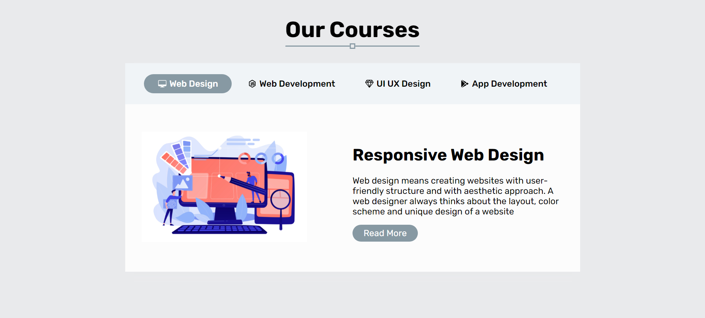
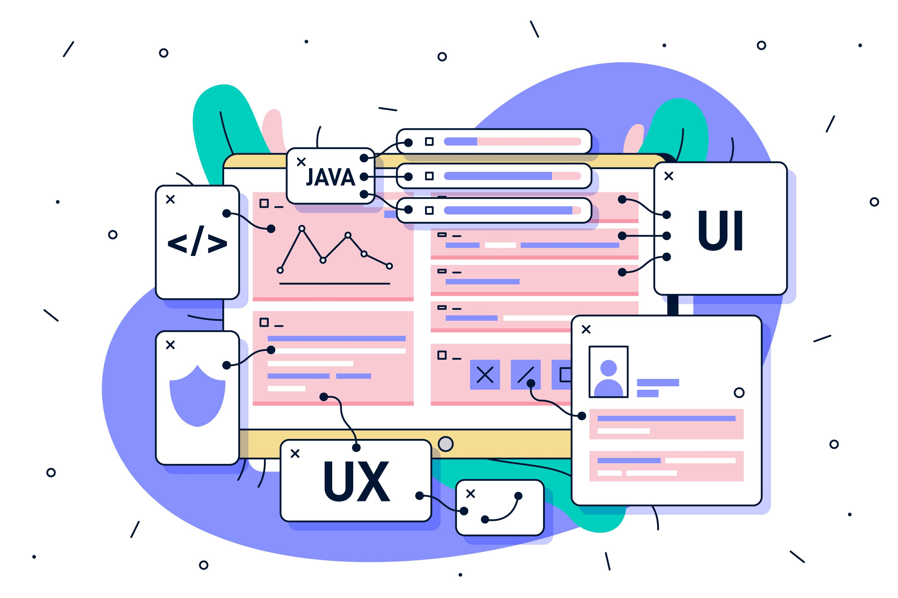

# How to build Responsive Animated Tabs using HTML5 CSS3 & Javascript



[▶▶ video link]()

----------
# Code Snippets

## HTML5
```html
<!DOCTYPE html>
<html lang="en">
  <head>
    <meta charset="UTF-8" />
    <meta http-equiv="X-UA-Compatible" content="IE=edge" />
    <meta name="viewport" content="width=device-width, initial-scale=1.0" />
    <title>Tab Components</title>
    <link rel="stylesheet" href="style.css" />
  </head>
  <body>
    <div class="container">
      <header>
        <h1 class="section-heading">Our Courses</h1>
      </header>
    </div>
    <div class="container">
      <div class="tab-container">
        <div class="tab-filter-container">
          <li class="filter-btn active" data-tab="web-design">
            <ion-icon name="desktop-outline"></ion-icon>
            Web Design
          </li>
          <li class="filter-btn" data-tab="web-development">
            <ion-icon name="logo-nodejs"></ion-icon>
            Web Development
          </li>
          <li class="filter-btn" data-tab="ux-design">
            <ion-icon name="diamond-outline"></ion-icon>
            UI UX Design
          </li>
          <li class="filter-btn" data-tab="app-development">
            <ion-icon name="logo-google-playstore"></ion-icon>
            App Development
          </li>
        </div>
        <div class="tab-filter-item-container">
          <div class="tab-item web-design select_tab">
            <div class="tab-content-left">
              
            </div>
            <div class="tab-content-right">
              <h1 class="tab-heading">Responsive Web Design</h1>
              <p class="paragraph">
                Web design means creating websites with user-friendly structure
                and with aesthetic approach. A web designer always thinks about
                the layout, color scheme and unique design of a website
              </p>
              <a href="#!" class="btn-primary">Read More</a>
            </div>
          </div>
          <div class="tab-item web-development">
            <div class="tab-content-left">
              <h1 class="tab-heading">Web Development</h1>
              <p class="paragraph">
                Web Development consists of two segments front end development
                and backend development. Front-end Developers work with visual
                designs of a website and build the sites with using of code
              </p>
              <a href="#!" class="btn-primary">Read More</a>
            </div>
            <div class="tab-content-right">
              
            </div>
          </div>
          <div class="tab-item ux-design">
            <div class="tab-content-left">
              
            </div>
            <div class="tab-content-right">
              <h1 class="tab-heading">UI UX Design</h1>
              <p class="paragraph">
                This course UX & UI Design is designed for those people, who
                wants to design anything to keep users on first priority and
                working on to make them happy.
              </p>
              <a href="#!" class="btn-primary">Read More</a>
            </div>
          </div>
          <div class="tab-item app-development">
            <div class="tab-content-left">
              <h1 class="tab-heading">App Development</h1>
              <p class="paragraph">
                With the world going mobile, the importance of apps is
                increasing by the day. App development hence refers to the
                creation of applications to be used on mobile devices.
              </p>
              <a href="#!" class="btn-primary">Read More</a>
            </div>
            <div class="tab-content-right">
              
            </div>
          </div>
        </div>
      </div>
    </div>
    <script
      type="module"
      src="https://unpkg.com/ionicons@5.5.2/dist/ionicons/ionicons.esm.js"
    ></script>
    <script
      nomodule
      src="https://unpkg.com/ionicons@5.5.2/dist/ionicons/ionicons.js"
    ></script>
    <script src="script.js"></script>
  </body>
</html>
```
## CSS3

```css
@import url('https://fonts.googleapis.com/css2?family=Rubik:wght@400;500;600;700&display=swap');
*,
*::after,
*::before {
  margin: 0;
  padding: 0;
  box-sizing: border-box;
  list-style-type: none;
  text-decoration: none;
}
:root {
  --container: 120rem;
  --primary: hsl(201.43, 13.21%, 58.43%);
  --white: hsl(0, 0%, 100%);
  --white-light: hsl(0, 0%, 99%);
  --box-shadow: hsl(220, 7.32%, 91.96%);
}
html {
  font-size: 62.5%;
}
body {
  font-size: 1.6rem;
  font-family: 'Rubik', sans-serif;
  background: var(--box-shadow);
}
.container {
  max-width: var(--container);
  padding: 0 1rem;
  margin: 0 auto;
}
header {
  text-align: center;
}
.section-heading {
  margin: 3rem 0;
  font-size: 4rem;
  padding-bottom: 0.7rem;
  position: relative;
  display: inline-block;
}
.section-heading::before,
.section-heading::after {
  content: '';
  position: absolute;
}
.section-heading::before {
  width: 100%;
  height: 0.2rem;
  bottom: 0;
  left: 0;
  background: var(--primary);
  border-radius: 0.2rem;
}
.section-heading::after {
  bottom: -0.4rem;
  left: 50%;
  transform: translateX(-50%);
  width: 1rem;
  height: 1rem;
  border: 0.2rem solid var(--primary);
  background: var(--box-shadow);
}
.tab-container {
  width: 70%;
  margin: 0 auto 3rem auto;
  box-shadow: 0 0.8rem 1rem var(--box-shadow);
}
@media (max-width: 767px) {
  .tab-container {
    width: 90%;
  }
}
.tab-filter-container {
  padding: 2rem;
  text-align: center;
  background: hsl(205.71, 30.43%, 95.49%);
}
.filter-btn {
  display: inline-flex;
  padding: 0.8rem 2.5rem;
  cursor: pointer;
  border-radius: 2rem;
  align-items: center;
  gap: 0.5rem;
  font-weight: 500;
}
.filter-btn.active {
  background: var(--primary);
  color: var(--white);
}
.tab-filter-item-container {
  background: var(--white);
  margin: 0 auto;
  position: relative;
  overflow: hidden;
}
.tab-item {
  width: 100%;
  height: 100%;
  position: absolute;
  padding: 0rem 3rem;
  transform: translateY(100%);
  background: var(--white-light);
  transition: transform 0.5s ease-in-out;
  display: grid;
  grid-template-columns: repeat(auto-fit, minmax(29rem, 1fr));
  place-items: center start;
}
.tab-img {
  width: 30rem;
}
.tab-heading {
  padding: 2rem 0;
  font-size: 3rem;
}
.tab-item.select_tab {
  transform: translateY(0);
  transition: transform 0.5s ease-in-out;
  background: var(--white-light);
  animation: feadIn 0.6s ease-in-out;
}
.btn-primary {
  margin-top: 1.5rem;
  display: inline-block;
  background: var(--primary);
  padding: 0.6rem 2rem;
  border-radius: 2rem;
  color: var(--white);
}
@keyframes feadIn {
  0% {
    opacity: 0;
  }
  100% {
    opacity: 1;
  }
}
```
## Javascript
```javascript
let filter_btn = document.querySelectorAll('.filter-btn');
let tab_items = document.querySelectorAll('.tab-item');

for (let i = 0; i < filter_btn.length; i++) {
  filter_btn[i].addEventListener('click', function () {
    for (let j = 0; j < filter_btn.length; j++) {
      filter_btn[j].classList.remove('active');
    }
    let select_tab = filter_btn[i].getAttribute('data-tab');
    filter_btn[i].classList.add('active');
    for (let t = 0; t < tab_items.length; t++) {
      document.querySelector('.tab-filter-item-container').style.height =
        tab_items[t].scrollHeight + 'px';
      if (tab_items[t].classList.contains(select_tab)) {
        tab_items[t].classList.add('select_tab');
      } else {
        tab_items[t].classList.remove('select_tab');
      }
    }
  });
}

for (let th = 0; th < tab_items.length; th++) {
  document.querySelector('.tab-filter-item-container').style.height =
    tab_items[th].scrollHeight + 'px';
}
```