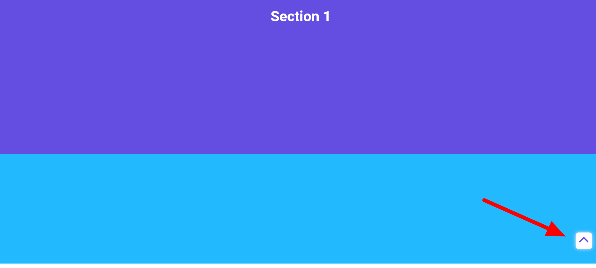

# Back To Top Button (Html css & javascript)



[ ▶ video](https://youtu.be/rw8qSfi4bc4)

## Code Snippets

### HTML5 & Javascript
```html
<!DOCTYPE html>
<html lang="en">
  <head>
    <meta charset="UTF-8" />
    <meta http-equiv="X-UA-Compatible" content="IE=edge" />
    <meta name="viewport" content="width=device-width, initial-scale=1.0" />
    <title>Back To Top</title>
    <link rel="stylesheet" href="style.css" />
  </head>
  <body>
    <section>
      <h1>Section 1</h1>
    </section>
    <section>
      <h1>Section 2</h1>
    </section>
    <section>
      <h1>Section 3</h1>
    </section>
    <section>
      <h1>Section 4</h1>
    </section>
    <div class="back_to_top">
      <ion-icon name="chevron-up-outline"></ion-icon>
    </div>
    <script
      type="module"
      src="https://unpkg.com/ionicons@5.5.2/dist/ionicons/ionicons.esm.js"
    ></script>
    <script
      nomodule
      src="https://unpkg.com/ionicons@5.5.2/dist/ionicons/ionicons.js"
    ></script>
    <script>
      let back_to_top = document.querySelector('.back_to_top');
      window.addEventListener('scroll', () => {
        if (window.pageYOffset > 100) {
          back_to_top.classList.add('show');
        } else {
          back_to_top.classList.remove('show');
        }
      });
      back_to_top.addEventListener('click', function (e) {
        window.scrollTo({
          top: 0,
          left: 0,
          behavior: 'smooth',
        });
      });
    </script>
  </body>
</html>
```
### CSS3
```css
@import url('https://fonts.googleapis.com/css2?family=Roboto:wght@400;500;700&display=swap');
* {
  margin: 0;
  padding: 0;
  box-sizing: border-box;
}
section {
  width: 100%;
  height: 100vh;
  display: flex;
  justify-content: center;
  align-items: center;
  color: #fff;
}
section:nth-of-type(even) {
  background: rgb(34, 185, 255);
}
section:nth-of-type(odd) {
  background: rgb(100, 78, 226);
}
section h1 {
  font-family: 'Roboto', sans-serif;
  font-size: 35px;
}
.back_to_top {
  position: fixed;
  right: 30px;
  bottom: 30px;
  width: 35px;
  height: 35px;
  line-height: 35px;
  text-align: center;
  background: #fff;
  border-radius: 0.4rem;
  pointer-events: none;
  opacity: 0;
  box-shadow: 0 0 0.5rem rgb(231, 231, 231);
  transition: all 0.2s ease-in-out;
  transform: translateY(-30rem);
}
ion-icon {
  color: rgb(100, 78, 226);
  font-size: 30px;
}
.back_to_top.show {
  opacity: 1;
  pointer-events: auto;
  cursor: pointer;
  transform: translateY(0rem);
}
```