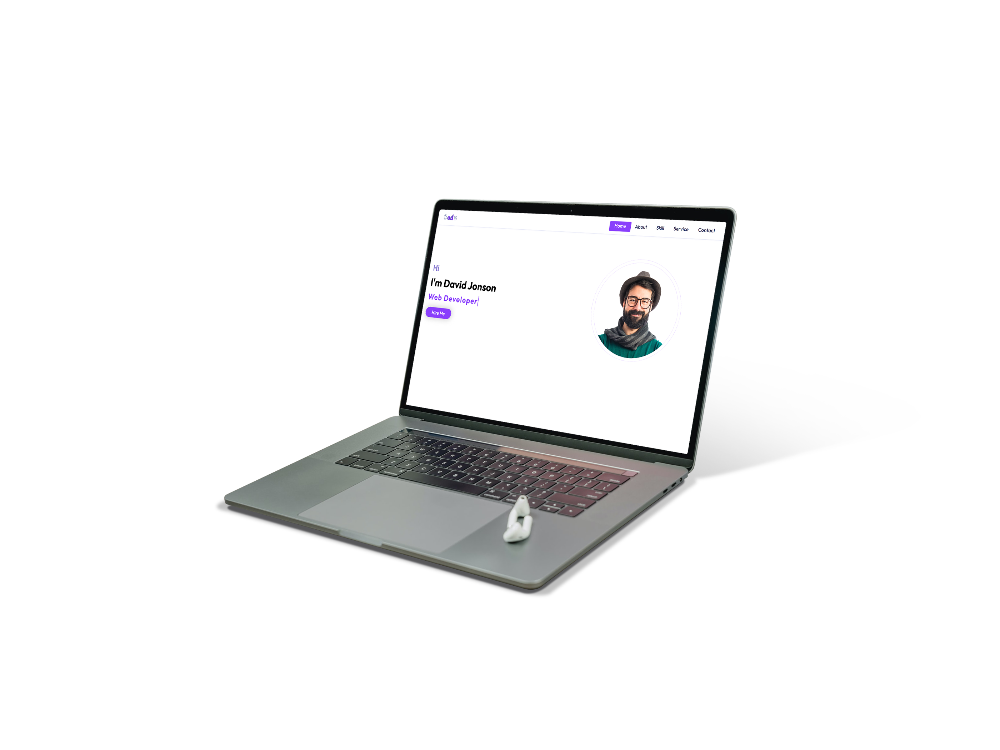

# Response Portfolio Website Design | Javascript



[⏯ watch video](https://www.youtube.com/watch?v=0u01PqgmGs8&ab_channel=Cods)

# Code Snippets

## HTML5
```html
<!DOCTYPE html>
<html lang="en">
  <head>
    <meta charset="UTF-8" />
    <meta http-equiv="X-UA-Compatible" content="IE=edge" />
    <meta name="viewport" content="width=device-width, initial-scale=1.0" />
    <title>Portfolio</title>
    <link rel="stylesheet" href="style.css" />
  </head>
  <body>
    <section id="hero">
      <header>
        <div class="container">
          <nav class="navigation">
            
            <div class="mobile_icon">
              <div class="line"></div>
            </div>
            <ul class="nav_menu">
              <div id="marker"></div>
              <li class="nav_list">
                <a href="#!" class="nav_link active">Home</a>
              </li>
              <li class="nav_list">
                <a href="#!" class="nav_link">About</a>
              </li>
              <li class="nav_list">
                <a href="#!" class="nav_link">Skill</a>
              </li>
              <li class="nav_list">
                <a href="#!" class="nav_link">Service</a>
              </li>
              <li class="nav_list">
                <a href="#!" class="nav_link">Contact</a>
              </li>
            </ul>
          </nav>
        </div>
      </header>
      <div class="container">
        <div class="hero-container">
          <div class="hero_left">
            <span class="f-10">Hi</span>
            <h1 class="hero_heading">I'm David Jonson</h1>
            <h2 class="typing">
              <span
                class="txt-type"
                data-words='["Web Designer","App Designer","Web Developer","Graphic Designer"]'
                data-wait="1000"
              ></span>
            </h2>
            <a href="#!" class="btn-primary">Hire Me</a>
          </div>
          <div class="hero_right">
            
          </div>
        </div>
      </div>
    </section>
    <script src="script.js"></script>
  </body>
</html>
```
## CSS3
```css
@import url('https://fonts.googleapis.com/css2?family=Outfit:wght@400;500;700&display=swap');
* {
  margin: 0;
  padding: 0;
  box-sizing: border-box;
  text-decoration: none;
  list-style-type: none;
}

:root {
  --primary: #8a3ffc;
  --primary-border: rgba(138, 63, 252, 0.2);
  --white: #fff;
  --black: #0e0b3d;
  --container: 120rem;
  --nav-height: 6rem;
}
.container {
  max-width: var(--container);
  width: calc(100% - 2rem);
  padding: 0 1rem;
  margin: 0 auto;
}
html {
  font-size: 62.5%;
}
body {
  font-size: 1.6rem;
  font-family: 'Outfit', sans-serif;
}
header {
  box-shadow: 0 0 0.4rem rgba(139, 150, 214, 0.5);
}
.btn-primary {
  color: var(--white);
  display: inline-block;
  background: var(--primary);
  font-size: 1.8rem;
  border-radius: 2rem;
  margin-top: 1rem;
  font-weight: bold;
  padding: 0.8rem 3rem;
  transition: box-shadow 0.5s ease-in-out;
  box-shadow: 0 0 2rem 0.5rem rgba(175, 175, 175, 0.5);
}
.btn-primary:hover {
  transition: box-shadow 0.5s ease-in-out;
  box-shadow: inset 0 0 2rem 0.5rem rgba(255, 255, 255, 0.74);
}
.logo {
  width: 8rem;
  height: 5rem;
  object-fit: cover;
}
.navigation {
  height: var(--nav-height);
  display: flex;
  justify-content: space-between;
  align-items: center;
}
.nav_list {
  display: inline-block;
  margin: 0 1.6rem;
}
.nav_link {
  position: relative;
  font-size: 1.7rem;
  color: var(--black);
  font-weight: 500;
  border-radius: 0.2rem;
  outline: none;
}
.f-10 {
  font-size: 3rem;
  color: #8e80d3;
  font-weight: 600;
}
.hero_heading {
  font-size: 4rem;
}
.hero-container {
  padding: 9rem 0;
  display: grid;
  grid-template-columns: repeat(2, 1fr);
  place-items: center end;
  grid-gap: 2rem;
}
.hero_left {
  width: 100%;
  place-items: center start;
}
.profile {
  width: 32rem;
  border-radius: 50%;
  margin-right: 10rem;
  background-size: cover;
  border: 0.1rem solid var(--primary-border);
  outline-offset: 1rem;
  outline: 0.1rem solid var(--primary-border);
}
.hero_left * {
  margin: 1rem 0;
}
ul {
  position: relative;
}
.nav_link.active {
  color: var(--white);
  animation: wait 0.5s linear;
}
#marker {
  position: absolute;
  height: 3.4rem;
  left: -0.4rem;
  top: -0.4rem;
  padding: 0.6rem 2rem;
  width: 8.5rem;
  background: var(--primary);
  border-radius: 0.4rem;
  transition: width 0.5s ease-in-out, height 0.5s ease-in-out,
    left 0.5s ease-in-out;
  position: absolute;
}

.typing {
  letter-spacing: 0.2rem;
  font-size: 3rem;
}
.txt-type {
  color: var(--primary);
  border-right: 0.3rem solid var(--primary);
}
@keyframes wait {
  0% {
    color: var(--black);
  }
  100% {
    color: var(--white);
  }
}
@media (max-width: 768px) {
  .hero-container {
    padding: 3rem 0;
    grid-template-columns: repeat(1, 1fr);
    place-content: center center;
    place-items: center;
    gap: 5rem;
  }
  .hero_right {
    grid-column: 1;
    grid-row: 1;
  }
  .hero_left {
    grid-column: -2;
    grid-row: 2;
    text-align: center;
  }
  .profile {
    margin-top: 3rem;
    width: 27rem;
    margin-right: 0;
  }
  .nav_menu {
    position: absolute;
    top: var(--nav-height);
    left: 0;
    width: 100%;
    height: calc(100vh - var(--nav-height));
    background: rgba(255, 255, 255, 0.9);
    opacity: 0;
    visibility: hidden;
    pointer-events: none;
    transition: all 0.5s ease-in-out;
  }
  .nav_menu.active {
    opacity: 1;
    visibility: visible;
    pointer-events: auto;
    transition: all 0.5s ease-in-out;
    animation: menuBlur 0.5s linear;
  }
  @keyframes menuBlur {
    0% {
      filter: blur(1rem);
    }
    100% {
      filter: blur(0);
    }
  }
  #marker {
    display: none;
  }
  .nav_list {
    display: block;
    padding: 1rem 0;
    text-align: center;
  }
  .nav_link.active {
    padding: 0.5rem 1.5rem;
    background: var(--primary);
    color: var(--white);
    border-radius: 0.3rem;
    cursor: pointer;
    transition: all 0.5s ease-in-out;
  }
  .mobile_icon {
    position: relative;
    width: 3.5rem;
    height: 3.5rem;
    cursor: pointer;
  }
  .line {
    position: relative;
    width: 100%;
    height: 0.3rem;
    top: 1.5rem;
    background: var(--primary);
    border-radius: 0.1rem;
    transition: all 0.5s ease-in-out;
  }
  .line.active {
    background: transparent;
  }
  .line::before,
  .line::after {
    left: 0;
    content: '';
    position: absolute;
    width: 100%;
    height: 0.3rem;
    background: var(--primary);
    border-radius: inherit;
    transition: all 0.5s ease-in-out;
  }
  .line::before {
    transform: translateY(-1rem);
  }
  .line.active::before {
    transform: rotate(-45deg);
  }
  .line::after {
    transform: translateY(1rem);
  }
  .line.active::after {
    transform: rotate(45deg);
  }
}
```
## Javascript
```javascript
let mobile_icon = document.querySelector('.mobile_icon');
let mobile_icon_line = document.querySelector('.line');
let mobile_menu = document.querySelector('.nav_menu');
let marker = document.querySelector('#marker');
var nav_links = document.querySelectorAll('nav li a');

mobile_icon.addEventListener('click', () => {
  mobile_icon_line.classList.toggle('active');
  mobile_menu.classList.toggle('active');
});

function indicator(e) {
  marker.style.left = `${e.offsetLeft - 20}px`;
  marker.style.top = `${e.offsetTop - 4}px`;
  marker.style.width = `${e.offsetWidth + 40}px`;
  marker.style.height = `${e.offsetHeight + 12}px`;
}
nav_links.forEach((link) => {
  link.addEventListener('click', (e) => {
    e.preventDefault();
    nav_links.forEach((link) => link.classList.remove('active'));
    link.classList.add('active');
    indicator(e.target);
  });
});
document.addEventListener('DOMContentLoaded', init);
function init() {
  let textElement = document.querySelector('.txt-type');
  let words = JSON.parse(textElement.getAttribute('data-words'));
  let wait = parseInt(textElement.getAttribute('data-wait'));
  let txt = '';
  let wordIndex = 0;
  let isDeleting = false;
  function type() {
    const current = wordIndex % words.length;
    const fullTxt = words[current];
    if (isDeleting) {
      txt = fullTxt.substring(0, txt.length - 1);
    } else {
      txt = fullTxt.substring(0, txt.length + 1);
    }
    textElement.innerHTML = `${txt}`;
    let typeSpeed = 500;
    if (isDeleting) {
      typeSpeed /= 2;
    }
    if (!isDeleting && txt === fullTxt) {
      typeSpeed = wait;
      isDeleting = true;
    } else if (isDeleting && txt === '') {
      isDeleting = false;
      wordIndex++;
      typeSpeed = 500;
    }
    setTimeout(() => type(), typeSpeed);
  }
  type();
}
```