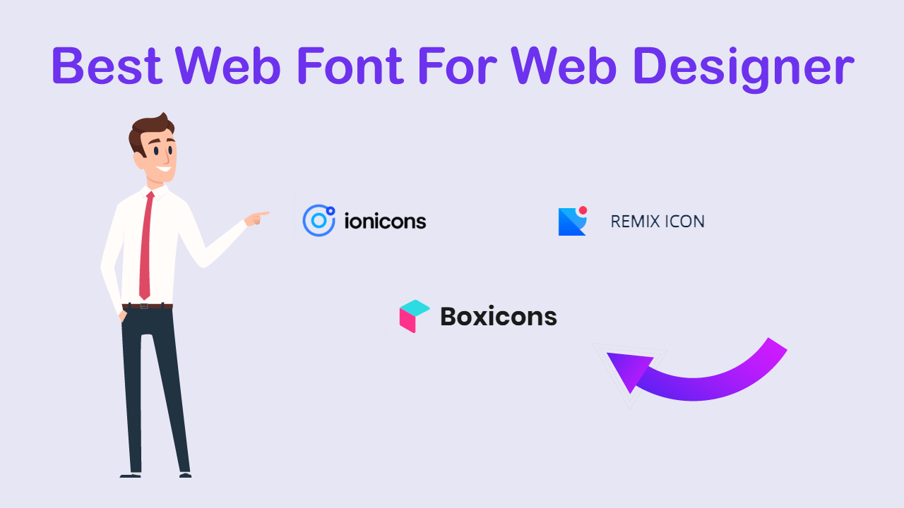

# Best Web Font For Web Designer



[watch on youtube](https://youtu.be/FDMNF8SNxM0)

# Code snippets

## ionicons

[ionicons](https://ionic.io/ionicons)

```html
<!DOCTYPE html>
<html lang="en">
  <head>
    <meta charset="UTF-8" />
    <meta http-equiv="X-UA-Compatible" content="IE=edge" />
    <meta name="viewport" content="width=device-width, initial-scale=1.0" />
    <title>ion-icon</title>
  </head>
  <body>
    <ion-icon name="bag-handle-outline" size="large"></ion-icon>
    <ion-icon name="flask-outline" size="large"></ion-icon>
    <script
      type="module"
      src="https://unpkg.com/ionicons@5.5.2/dist/ionicons/ionicons.esm.js"
    ></script>
    <script
      nomodule
      src="https://unpkg.com/ionicons@5.5.2/dist/ionicons/ionicons.js"
    ></script>
  </body>
</html>
```

## boxicons

[boxicons](https://boxicons.com/)

```html
<!DOCTYPE html>
<html lang="en">
  <head>
    <meta charset="UTF-8" />
    <meta http-equiv="X-UA-Compatible" content="IE=edge" />
    <meta name="viewport" content="width=device-width, initial-scale=1.0" />
    <title>boxicons</title>
  </head>
  <body>
    <box-icon name="basket"></box-icon>
    <box-icon name="store" color="pink"></box-icon>
    <script src="https://unpkg.com/boxicons@2.1.2/dist/boxicons.js"></script>
  </body>
</html>
```

## remixicon

[remixicon](https://remixicon.com/)

```html
<!DOCTYPE html>
<html lang="en">
  <head>
    <meta charset="UTF-8" />
    <meta http-equiv="X-UA-Compatible" content="IE=edge" />
    <meta name="viewport" content="width=device-width, initial-scale=1.0" />
    <title>remixicon</title>
    <link href="https://cdn.jsdelivr.net/npm/remixicon@2.5.0/fonts/remixicon.css" rel="stylesheet">
  </head>
  <body>
    <i class="ri-macbook-fill ri-3x"></i>
    <i class="ri-heart-line"></i>
    <i class="ri-virus-line"></i>
  </body>
</html>
```