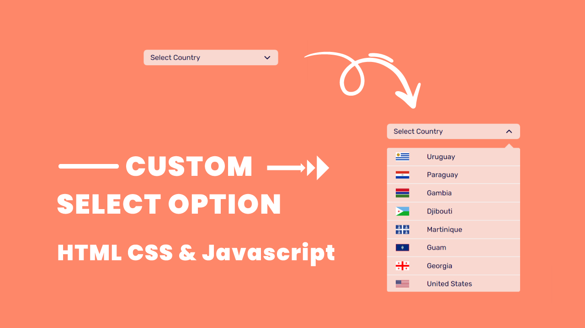

# Custom Select Option | Javascript



[Watch On Youtube](https://youtu.be/zb_vlaKyoEQ)

# Code Snippets

## HTML5
```html
<!DOCTYPE html>
<html lang="en">
  <head>
    <meta charset="UTF-8" />
    <meta http-equiv="X-UA-Compatible" content="IE=edge" />
    <meta name="viewport" content="width=device-width, initial-scale=1.0" />
    <title>Select Option Dropdown</title>
    <link rel="stylesheet" href="style.css" />
  </head>
  <body>
    <div class="container">
      <div class="dropdown">
        <div class="select" value="select">
          <span>Select Country</span>
          <ion-icon name="chevron-down-outline"></ion-icon>
        </div>
        <ul class="select-dropdown"></ul>
      </div>
    </div>
    <script
      type="module"
      src="https://unpkg.com/ionicons@5.5.2/dist/ionicons/ionicons.esm.js"
    ></script>
    <script
      nomodule
      src="https://unpkg.com/ionicons@5.5.2/dist/ionicons/ionicons.js"
    ></script>
    <script src="script.js"></script>
  </body>
</html>
```
## CSS
```css
@import url('https://fonts.googleapis.com/css2?family=Rubik:wght@400;500;600;700&display=swap');
*,
*::after,
*::before {
  margin: 0;
  padding: 0;
  box-sizing: inherit;
  text-decoration: none;
  list-style-type: none;
}
:root {
  --primary: #fe8769;
  --secondary: #f9d8d0;
  --border: #f3f3f3;
  --white: #fff;
  --black: #06033c;
  --container: 112rem;
  --m-auto: 0 auto;
  --transition: all 0.5s ease-in-out;
}
html {
  font-size: 62.5%;
}
body {
  font-size: 1.6rem;
  box-sizing: border-box;
  font-family: 'Rubik', sans-serif;
  background: var(--primary);
}

.container {
  max-width: var(--container);
  margin: var(--m-auto);
  min-height: 100vh;
  display: flex;
  align-items: center;
  justify-content: center;
}
.select {
  width: 30rem;
  background: var(--secondary);
  color: var(--black);
  padding: 0.8rem 1.5rem;
  border-radius: 0.7rem;
  margin: 1rem 0;
  display: flex;
  justify-content: space-between;
  align-items: center;
  cursor: pointer;
  transition: var(--transition);
}
.select ion-icon {
  font-size: 1.9rem;
  transition: var(--transition);
}
.select.selected ion-icon {
  transform: rotate(180deg);
  transition: var(--transition);
}
.select.selected {
  position: relative;
}
.select.selected::after {
  content: '';
  position: absolute;
  bottom: -2rem;
  right: 1.5rem;
  border-left: 1rem solid transparent;
  border-top: 1rem solid transparent;
  border-right: 1rem solid transparent;
  border-bottom: 1rem solid var(--secondary);
  animation: feadIn 1s ease-in-out backwards;
}
@keyframes feadIn {
  0% {
    opacity: 0;
  }
  100% {
    opacity: 1;
  }
}
.select-dropdown {
  max-height: 0;
  opacity: 0;
  visibility: hidden;
  pointer-events: none;
  width: 30rem;
  background: var(--secondary);
  color: var(--black);
  border-radius: 0.4rem;
  transition: var(--transition);
  overflow-y: auto;
}
.select-dropdown::-webkit-scrollbar {
  width: 0;
}
.select-dropdown.active {
  margin: 2rem 0;
  max-height: 32.5rem;
  opacity: 1;
  visibility: visible;
  pointer-events: auto;
  transition: var(--transition);
}
.option {
  padding: 1rem 2rem;
  cursor: pointer;
  display: flex;
  align-items: center;
  transition: var(--transition);
  gap: 4rem;
}
.option:not(:last-child) {
  border-bottom: 0.15rem solid var(--border);
}
.option:hover {
  background: var(--white);
  transition: var(--transition);
}
.option img {
  width: 3rem;
  height: auto;
}
```
## Javascript
```javascript
let select_dropdown = document.querySelector('.select-dropdown');

async function countryList() {
  let data = await fetch('https://restcountries.com/v3.1/all');
  let response = await data.json();

  response.forEach((element) => {
    let option = document.createElement('li');
    option.className = 'option';
    option.setAttribute('value', element.name.common);
    option.innerHTML = ` <span>${element.name.common}</span>`;
    select_dropdown.appendChild(option);
  });

  let select = document.querySelector('.select');
  let select_value = document.querySelector('.select span');
  let options = document.querySelectorAll('.option');

  select.addEventListener('click', () => {
    select.classList.toggle('selected');
    select_dropdown.classList.toggle('active');
  });

  options.forEach((option) => {
    option.addEventListener('click', (e) => {
      let selected = e.target.getAttribute('value');
      select.classList.remove('selected');
      select_dropdown.classList.remove('active');
      select.setAttribute('value', selected);
      select_value.innerText = e.target.innerText;
    });
  });
}
countryList();
```
