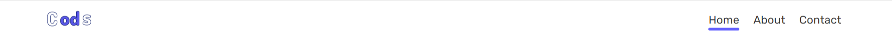

# Intreactive Nav Links Hover Effect | Javascript



[▶▶ video link]()

# Code Snippets

## HTML5

```html
<!DOCTYPE html>
<html lang="en">
  <head>
    <meta charset="UTF-8" />
    <meta http-equiv="X-UA-Compatible" content="IE=edge" />
    <meta name="viewport" content="width=device-width, initial-scale=1.0" />
    <title>Nav Links hover Effect</title>
    <link rel="stylesheet" href="style.css" />
  </head>
  <body>
    <header>
      <nav>
        <div class="logo">
          
        </div>
        <ul>
          <div id="marker"></div>
          <li>
            <a href="#">Home</a>
          </li>
          <li><a href="#">About</a></li>
          <li><a href="#">Contact</a></li>
        </ul>
      </nav>
    </header>
    <script src="script.js"></script>
  </body>
</html>
```
## CSS3

```css
@import url('https://fonts.googleapis.com/css2?family=Rubik:wght@400;500;600;700&display=swap');
* {
  margin: 0;
  padding: 0;
  box-sizing: border-box;
  list-style-type: none;
  font-family: 'Rubik', sans-serif;
}
header {
  box-shadow: 0 0 0.2rem rgba(19, 9, 61, 0.15);
}
nav {
  height: 60px;
  width: 90%;
  margin: 0 auto;
  position: relative;
  display: flex;
  align-items: center;
  justify-content: space-between;
}
.logo img {
  width: 80px;
  height: 50px;
  object-fit: cover;
}
ul {
  position: relative;
}
nav li {
  display: inline-block;
  margin-right: 1rem;
}
nav li a {
  position: relative;
  font-size: 1rem;
  color: #333;
  text-decoration: none;
}
ul #marker {
  position: absolute;
  height: 4px;
  left: 0;
  bottom: -6px;
  width: 43.78125px;
  background: rgb(100, 97, 255);
  border-radius: 4px;
  transition: all 0.5s ease-in-out;
}
```

## Javascript

```javascript
let marker = document.querySelector('#marker');
let nav_links = document.querySelectorAll('nav ul li a');

function indicator(e) {
  marker.style.left = e.offsetLeft + 'px';
  marker.style.width = e.offsetWidth + 'px';
}
nav_links.forEach((link) => {
  link.addEventListener('click', (e) => {
    e.preventDefault();
    indicator(e.target);
  });
});
```