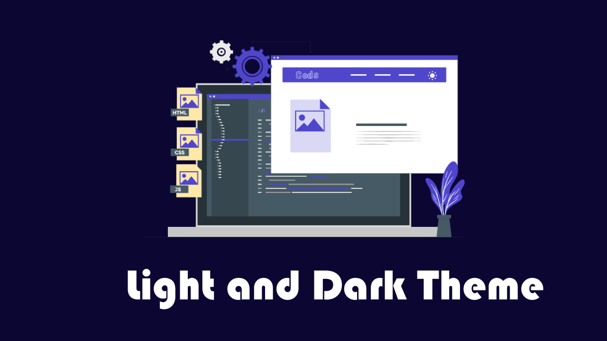
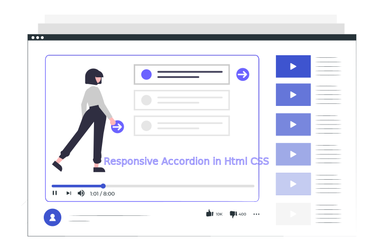

# Light and Dark Mode Website (Javascript)



[▶ video link](https://youtu.be/yS_TcLIRdds)

# code Snippets


----------
## HTML5 
```html
<!DOCTYPE html>
<html lang="en">
  <head>
    <meta charset="UTF-8" />
    <meta http-equiv="X-UA-Compatible" content="IE=edge" />
    <meta name="viewport" content="width=device-width, initial-scale=1.0" />
    <title>Light and dark theme</title>
    <link rel="stylesheet" href="style.css" />
  </head>
  <body>
    <section id="hero">
      <header>
        <div class="container">
          <nav>
            <div class="logo">
              
            </div>
            <ul class="nav_menu">
              <li class="nav_list"><a href="#!" class="nav_link">Home</a></li>
              <li class="nav_list">
                <a href="#!" class="nav_link">Project</a>
              </li>
              <li class="nav_list">
                <a href="#!" class="nav_link">Gallery</a>
              </li>
              <li class="nav_list"><a href="#!" class="nav_link">About</a></li>
              <li class="nav_list">
                <a href="#!" class="nav_link">Contact</a>
              </li>
            </ul>
            <div class="theme-icon">
              <ion-icon name="sunny-outline" class="theme-switcher"></ion-icon>
            </div>
          </nav>
        </div>
      </header>
      <div class="container">
        <div class="hero-content-container">
          
          <div class="hero-content">
            <h1 class="heading">Light and Dark Theme</h1>
            <p class="paragraph">
              A dark theme displays dark surfaces across the majority of a UI.
              It's designed to be a supplemental mode to a default (or light)
              theme
            </p>
            <a href="#!" class="btn-primary">
              Watch video <ion-icon name="play-outline"></ion-icon>
            </a>
          </div>
        </div>
      </div>
    </section>
    <script
      type="module"
      src="https://unpkg.com/ionicons@5.5.2/dist/ionicons/ionicons.esm.js"
    ></script>
    <script
      nomodule
      src="https://unpkg.com/ionicons@5.5.2/dist/ionicons/ionicons.js"
    ></script>
    <script src="script.js"></script>
  </body>
</html>
```
## CSS3
```css
@import url('https://fonts.googleapis.com/css2?family=Rubik:wght@400;500;600;700;900&display=swap');
* {
  margin: 0;
  padding: 0;
  box-sizing: border-box;
  list-style-type: none;
  text-decoration: none;
}
:root {
  --nav-height: 6rem;
  --primary: #3e54cf;
  --white: #fff;
  transition: background 0.5s cubic-bezier(0.075, 0.82, 0.165, 1),
    color 0.5s cubic-bezier(0.075, 0.82, 0.165, 1);
}
html.dark {
  --nav-height: 6rem;
  --primary: #050d30;
  --white: #fff;
  transition: background 0.5s cubic-bezier(0.075, 0.82, 0.165, 1),
    color 0.5s cubic-bezier(0.075, 0.82, 0.165, 1);
}
html.light {
  --nav-height: 6rem;
  --primary: #7066fd;
  --white: #fff;
  transition: background 0.5s cubic-bezier(0.075, 0.82, 0.165, 1),
    color 0.5s cubic-bezier(0.075, 0.82, 0.165, 1);
}
html {
  font-size: 62.5%;
}
body {
  font-family: 'Rubik', sans-serif;
  background: var(--primary);
}
a,
p {
  font-size: 1.8rem;
}
#hero {
  height: 100vh;
  background: var(--primary);
}
.container {
  max-width: 114rem;
  width: calc(100% - 2rem);
  padding: 0 1rem;
  margin: 0 auto;
}
header {
  background: var(--primary);
  box-shadow: 0 0 0.2rem var(--white);
}
nav {
  height: var(--nav-height);
  display: flex;
  justify-content: space-between;
  align-items: center;
}
.logo .logo-img {
  width: 8rem;
  height: 5rem;
  object-fit: cover;
}
.nav_list {
  display: inline-block;
  margin-left: 3rem;
}
.nav_link {
  color: var(--white);
}
.theme-icon {
  cursor: pointer;
}
ion-icon {
  font-size: 1.6rem;
}
.theme-icon ion-icon {
  font-size: 2.5rem;
  color: var(--white);
  transition: all 0.5s ease-in-out;
}
.hero-content-container {
  height: calc(100vh - var(--nav-height));
  display: grid;
  grid-template-columns: repeat(2, 1fr);
  place-items: center;
}
.hero-img {
  width: 100%;
  height: auto;
}
.heading {
  color: var(--white);
  padding: 1rem 0;
  font-size: 3rem;
}
.paragraph {
  color: var(--white);
}
.btn-primary {
  margin-top: 2rem;
  padding: 0.7rem 2rem;
  font-size: 1.8rem;
  display: inline-block;
  background: var(--primary);
  color: var(--white);
  box-shadow: 0 0 0.1rem var(--white);
}
.btn-primary ion-icon {
  margin-bottom: -0.4rem;
}
```
## Javascript 
```javascript
let theme_switcher = document.querySelector('.theme-switcher');
let theme = localStorage.getItem('theme');
let icon = localStorage.getItem('icon');
setTheme(theme, icon);
theme_switcher.addEventListener('click', () => {
  if (theme_switcher.getAttribute('name') == 'sunny-outline') {
    setTheme('dark', 'moon-outline');
    theme_switcher.setAttribute('name', 'moon-outline');
  } else {
    setTheme('light', 'sunny-outline');
    theme_switcher.setAttribute('name', 'sunny-outline');
  }
});

function setTheme(theme, icon) {
  document.documentElement.className = theme;
  theme_switcher.setAttribute('name', icon);
  localStorage.setItem('theme', theme);
  localStorage.setItem('icon', icon);
  if (
    (theme_switcher.getAttribute('name') == '' && theme == '') ||
    (theme == null && icon == null) ||
    (theme == 'null' && icon == 'null')
  ) {
    theme_switcher.setAttribute('name', 'sunny-outline');
  }
}
```
