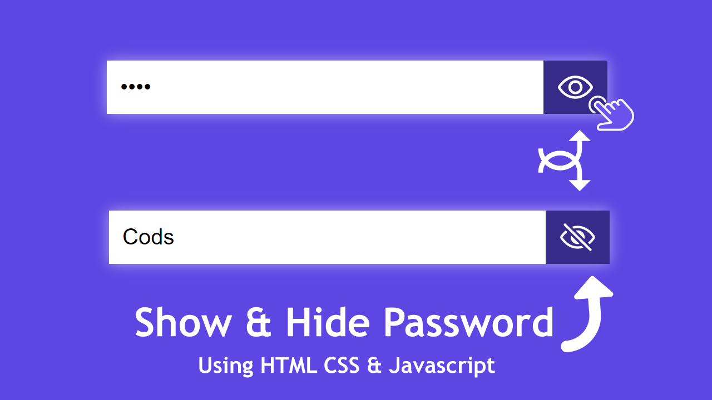

# Password Show & Hide | Javascript



[watch on youtube](https://youtu.be/K6U_rZkOa00)

# Code Snippets

## HTML5
```html
<!DOCTYPE html>
<html lang="en">
  <head>
    <meta charset="UTF-8" />
    <meta http-equiv="X-UA-Compatible" content="IE=edge" />
    <meta name="viewport" content="width=device-width, initial-scale=1.0" />
    <title>Document</title>
    <link rel="stylesheet" href="style.css">
  </head>
  <body>
    <div class="input-group">
      <input
        type="password"
        name="password"
        placeholder="Enter your password"
        class="password"
      />
      <ion-icon name="eye-outline" class="password_icon"></ion-icon>
    </div>
    <script
      type="module"
      src="https://unpkg.com/ionicons@5.5.2/dist/ionicons/ionicons.esm.js"
    ></script>
    <script
      nomodule
      src="https://unpkg.com/ionicons@5.5.2/dist/ionicons/ionicons.js"
    ></script>
    <script>
      let password_input = document.querySelector('.password');
      let password_icon = document.querySelector('.password_icon');
      password_icon.addEventListener('click', () => {
        if (password_input.type == 'password') {
          password_input.type = 'text';
          password_icon.setAttribute('name', 'eye-off-outline');
        } else {
          password_input.type = 'password';
          password_icon.setAttribute('name', 'eye-outline');
        }
      });
    </script>
  </body>
</html>
```
## CSS3

```css
* {
  margin: 0;
  padding: 0;
  box-sizing: border-box;
}
body {
  background: #5d46e2;
}
.input-group {
  background: #fff;
  display: flex;
  align-items: center;
  position: absolute;
  left: 50%;
  top: 50%;
  width: 300px;
  transform: translate(-50%, -50%);
  padding: 0 0 0 0.5rem;
  justify-content: space-between;
  box-shadow: 0 0 0.5rem #aea3f1;
}
.input-group input {
  width: 100%;
  outline: none;
  padding: 0.5rem 0.3rem 0.5rem 0;
  border: none;
}
.input-group ion-icon {
  background: #382a88;
  cursor: pointer;
  font-size: 1.6rem;
  padding: 0.2rem 0.5rem;
  color: #fff;
  --ionicon-stroke-width: 35px;
}
```