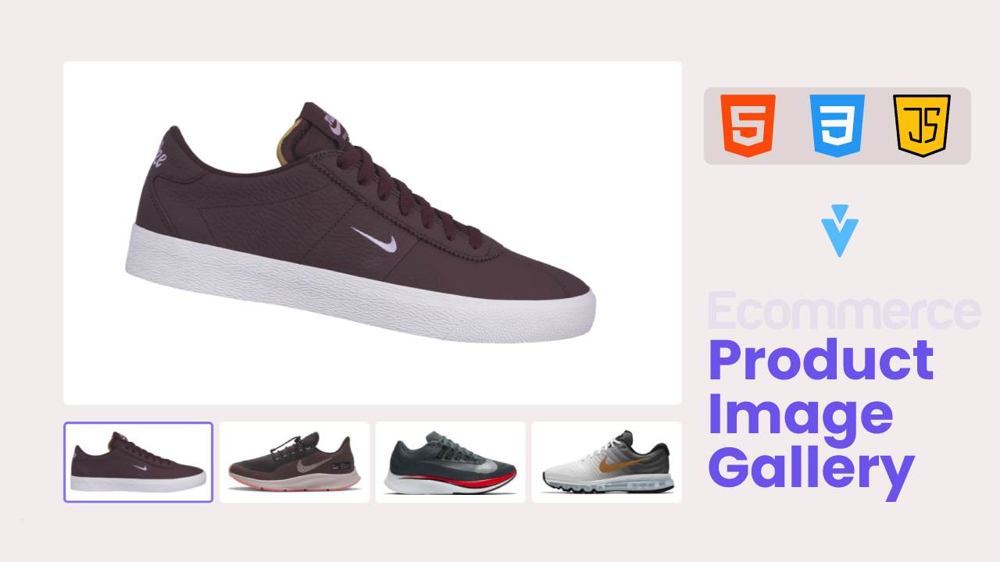

# Product Image Gallery Using HTML CSS & Javascirpt



[Watch On Youtube](https://youtu.be/4p3jtN0xnhQ)

# Code Snippets

## HTML

```html
<!DOCTYPE html>
<html lang="en">
  <head>
    <meta charset="UTF-8" />
    <meta http-equiv="X-UA-Compatible" content="IE=edge" />
    <meta name="viewport" content="width=device-width, initial-scale=1.0" />
    <title>Product Image gallery</title>
    <link rel="stylesheet" href="style.css" />
  </head>
  <body>
    <div class="container">
      <div class="product_image_gallery">
        <div class="product-img">
          
        </div>
        <div class="product-thumbnail-container">
          <div class="product-thumbnail active">
            
          </div>
          <div class="product-thumbnail">
            
          </div>
          <div class="product-thumbnail">
            
          </div>
          <div class="product-thumbnail">
            
          </div>
        </div>
      </div>
    </div>
    <script src="script.js"></script>
  </body>
</html>
```

## CSS

```css
* {
  margin: 0;
  padding: 0;
  box-sizing: border-box;
}
:root {
  --white: #fff;
  --bg: #f2ecec;
  --primary: #7d6be8;
}
html {
  font-size: 62.5%;
}
body {
  background: var(--bg);
}
.container {
  max-width: 74rem;
  margin: 0 auto;
  padding: 1.7rem 1rem;
}
.product-img {
  width: 100%;
  height: 40rem;
  position: relative;
  margin-bottom: 2rem;
  border-radius: 0.5rem;
  background: var(--white);
  overflow: hidden;
}
.product-img img {
  width: 55rem;
  height: 37rem;
  object-fit: contain;
  position: absolute;
  left: 50%;
  transform: translateX(-50%) rotate(10deg);
}
@media (max-width: 630px) {
  .product-img {
    height: 30rem;
  }
  .product-img img {
    width: 90%;
    height: 100%;
    padding: 1rem;
  }
}
@media (max-width: 375px) {
  .product-img {
    height: 25rem;
  }
}

.product-img img[data-index='2'],
.product-img img[data-index='4'] {
  transform: translateX(-50%) rotate(-10deg);
}
.product-thumbnail-container {
  display: grid;
  grid-template-columns: repeat(4, 1fr);
  justify-content: center;
  gap: 0.7rem;
}

.product-thumbnail {
  background: var(--white);
  border: 0.3rem solid var(--white);
  padding: 0.5rem;
  border-radius: 0.5rem;
  cursor: pointer;
  transition: all 0.5s ease-in-out;
}
.product-thumbnail.active {
  border: 0.3rem solid var(--primary);
}
.product-thumbnail img {
  width: 100%;
  height: 100%;
  object-fit: contain;
}
.product-down-animation {
  animation: down 0.5s ease;
}
@keyframes down {
  0% {
    top: -100%;
  }
  100% {
    top: 0%;
  }
}
```

## Javascript

```javascript
let product_img = document.querySelector('.product-img img');
let product_thumbnail = document.querySelectorAll('.product-thumbnail');

product_thumbnail.forEach((product) => {
  product.addEventListener('click', () => {
    product_thumbnail.forEach((product) => {
      product.classList.remove('active');
    });
    product.classList.add('active');

    let img = product.querySelector('img').getAttribute('src');
    let index = product.querySelector('img').getAttribute('data-index');

    product_img.setAttribute('src', img);
    product_img.setAttribute('data-index', index);

    product_img.classList.add('product-down-animation');
    setTimeout(() => {
      product_img.classList.remove('product-down-animation');
    }, 500);
  });
});
```