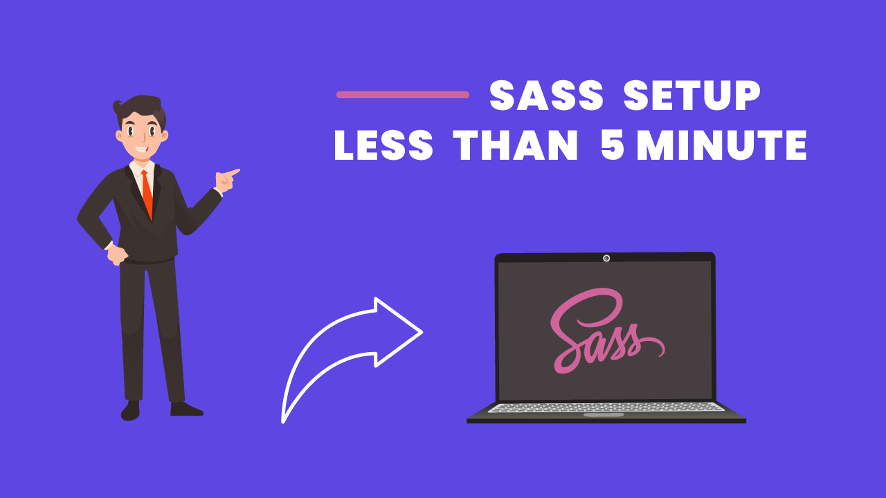

# SASS setup less than 5 Minute



[Watch On Youtube](https://youtu.be/K7zmx_kwtX0)

## setup Snippet

### step 1
```npm command
npm init -y
```
### step 2
```sass install command
npm i -g sass
```

> package.json

```json
  "scripts": {
    "sass": "sass --no-source-map --watch sass/style.scss css/style.css",
    "sass:compress": "sass --no-source-map --watch sass/style.scss css/compress.css --style compressed"
  },
```