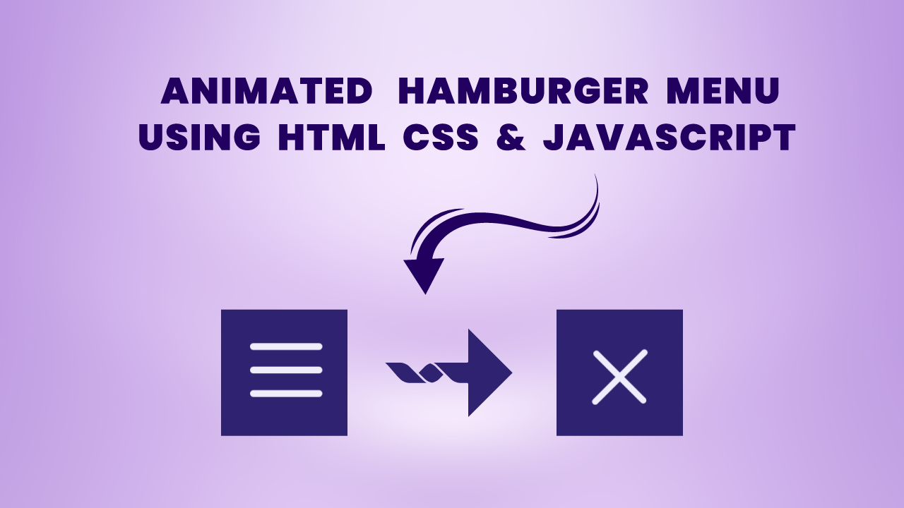

# Animated Hamburger Icon | Using HTML CSS & Javascript



[Watch On Youtube](https://youtu.be/0BP0k0mmdYo)

## Code Snippets
----------
## HTML
```html
<!DOCTYPE html>
<html lang="en">
  <head>
    <meta charset="UTF-8" />
    <meta http-equiv="X-UA-Compatible" content="IE=edge" />
    <meta name="viewport" content="width=device-width, initial-scale=1.0" />
    <title>Hamburger Icon</title>
    <link rel="stylesheet" href="style.css" />
  </head>
  <body>
      <div class="container">
          <div class="mobile_hamburger">
              <div class="hamburger_line"></div>
          </div>
      </div>
    <script src="script.js"></script>
  </body>
</html>
```
## CSS
```css
*,
*::after,
*::before {
  margin: 0;
  padding: 0;
  box-sizing: inherit;
}
:root {
  --bg: #2f2371;
  --icon: #efedfc;
  --transition: all 0.5s ease-in-out;
}
html {
  font-size: 62.5%;
  scroll-behavior: smooth;
}
body {
  box-sizing: border-box;
  height: 100vh;
  display: flex;
  align-items: center;
  justify-content: center;
  background: var(--bg);
}
.mobile_hamburger {
  width: 4rem;
  height: 4rem;
  display: flex;
  align-items: center;
  cursor: pointer;
}
.hamburger_line {
  position: relative;
  width: 100%;
  height: 0.35rem;
  background: var(--icon);
  border-radius: 1rem;
  transition: var(--transition);
}
.hamburger_line::before,
.hamburger_line::after {
  content: '';
  position: absolute;
  width: 100%;
  height: 100%;
  left: 0;
  background: var(--icon);
  border-radius: inherit;
  transition: var(--transition);
}
.hamburger_line::before {
  transform: translateY(-1.3rem);
}
.hamburger_line::after {
  transform: translateY(1.3rem);
}

.hamburger_line.active {
  transform: rotate(45deg);
}
.hamburger_line.active::before {
  top: -0.75rem;
  left: 50%;
  width: 50%;
  transform: translate(-50%, -100%) rotate(-90deg);
  border-top-left-radius: 0;
  border-bottom-left-radius: 0;
}
.hamburger_line.active::after {
  bottom: -0.75rem;
  width: 50%;
  left: 50%;
  transform: translate(-50%, 100%) rotate(-90deg);
  border-top-right-radius: 0;
  border-bottom-right-radius: 0;
}

/* Design Type 2 */

/* .hamburger_line.active {
  background: transparent;
}
.hamburger_line.active::before {
  transform: rotate(-45deg);
}
.hamburger_line.active::after {
  transform: rotate(45deg);
} */
```
## Javascript
```javascript
let hamburger = document.querySelector('.mobile_hamburger');
let hamburger_line = document.querySelector('.hamburger_line');

hamburger.addEventListener('click', () => {
  hamburger_line.classList.toggle('active');
});
```