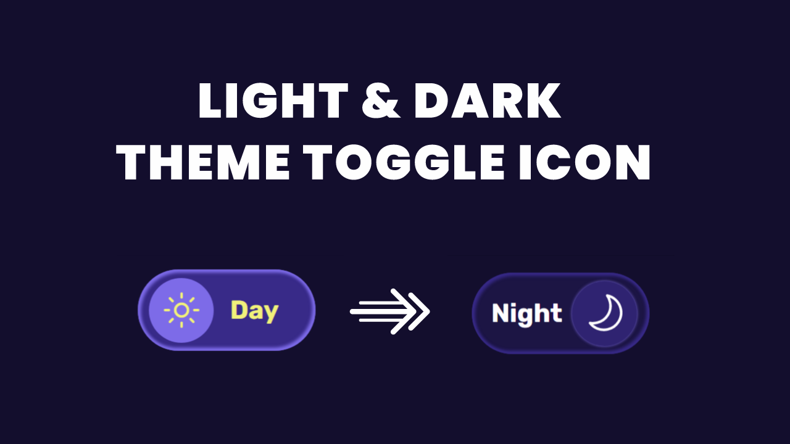

# Light and Dark Theme Toggle Using HTML CSS & JavaScript

[Watch On Youtube](https://youtu.be/dT35sEAozFg)
# Starter Code
## Web font
```html
<script
    type="module"
    src="https://unpkg.com/ionicons@5.5.2/dist/ionicons/ionicons.esm.js"
></script>
<script
    nomodule
    src="https://unpkg.com/ionicons@5.5.2/dist/ionicons/ionicons.js"
></script>
```
## CSS Reset
```css
@import url('https://fonts.googleapis.com/css2?family=Rubik:wght@700&display=swap');
*,
*::after,
*::before {
  margin: 0;
  padding: 0;
  box-sizing: inherit;
}
:root {
  --white: #fff;
  --bg: #130e2d;
  --light: #382a88;
  --dark: #1c1544;
  --light-icon: #7d6be8;
  --text-sunny: #f2f27a;
  --dark-icon: #2f2371;
  --transition: all 0.5s cubic-bezier(0.27, 0.74, 0.65, 0.68);
  --light-box-shadow: inset -0.1rem -0.1rem 0.2rem 0.1rem var(--light-icon),
    inset 0.1rem 0.1rem 0.2rem 0.1rem var(--light-icon);
  --dark-box-shadow: inset -0.1rem -0.1rem 0.2rem 0.1rem var(--light),
    inset 0.1rem 0.1rem 0.2rem 0.1rem var(--light);
}
html {
  font-size: 62.5%;
  scroll-behavior: smooth;
}
body {
  font-size: 1.6rem;
  box-sizing: border-box;
  height: 100vh;
  display: flex;
  align-items: center;
  justify-content: center;
  background: var(--bg);
}
```