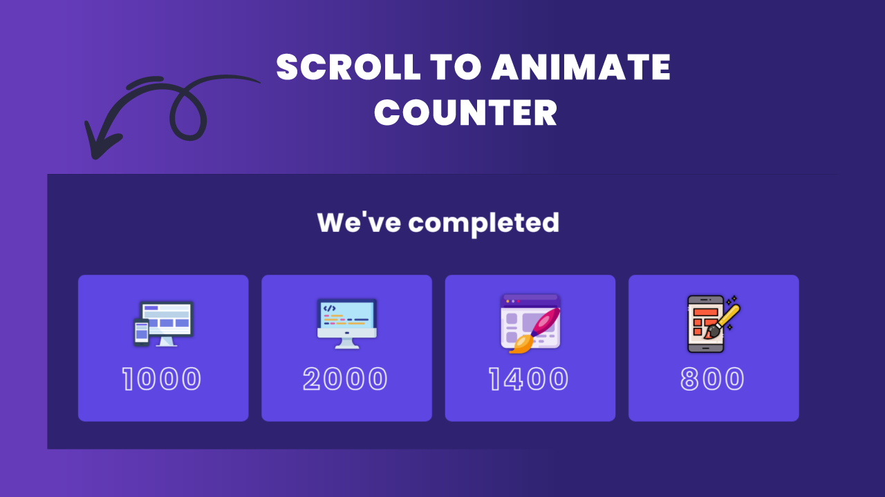

# Responsive Counter up Animation on Scroll using HTML CSS & Javascript

[Watch On Youtube](https://youtu.be/WroydnXVtLo)

## Code Snippets
----------
## HTML5
```html
<!DOCTYPE html>
<html lang="en">
  <head>
    <meta charset="UTF-8" />
    <meta http-equiv="X-UA-Compatible" content="IE=edge" />
    <meta name="viewport" content="width=device-width, initial-scale=1.0" />
    <title>Document</title>
    <link rel="stylesheet" href="style.css" />
  </head>
  <body>
    <section id="hero">
      <div class="container">
        <h1 class="section-heading">Hero</h1>
      </div>
    </section>
    <section id="section_counter">
      <div class="container">
        <h1 class="section-heading">We've completed</h1>
      </div>
      <div class="container">
        <div class="counter-grid">
          <div class="counter-item">
            
            <h1 class="counter" data-target="1000">0</h1>
          </div>
          <div class="counter-item">
            
            <h1 class="counter" data-target="2000">0</h1>
          </div>
          <div class="counter-item">
            
            <h1 class="counter" data-target="1400">0</h1>
          </div>
          <div class="counter-item">
            
            <h1 class="counter" data-target="800">0</h1>
          </div>
        </div>
      </div>
    </section>
    <section id="pricing">
      <div class="container">
        <h1 class="section-heading">Pricing</h1>
      </div>
    </section>
    <script src="script.js"></script>
  </body>
</html>
```
## CSS3
```css
@import url('https://fonts.googleapis.com/css2?family=Poppins:wght@400;500;600;700&display=swap');
*,
*::after,
*::before {
  margin: 0;
  padding: 0;
  box-sizing: inherit;
}
:root {
  --container: 112rem;
  --m-auto: 0 auto;
  --white: #fff;
  --bg-hero: #251c5a;
  --bg-counter: #2f2371;
  --bg-item: #5d46e2;
}
html {
  font-family: 'Poppins', sans-serif;
  font-size: 62.5%;
  scroll-behavior: smooth;
}
body {
  color: var(--white);
  font-size: 1.6rem;
  box-sizing: border-box;
}
.container {
  max-width: var(--container);
  margin: var(--m-auto);
  padding: 0 1rem;
}
section:not(#section_counter) {
  height: 100vh;
}
.section-heading {
  font-size: 4rem;
}
#hero,
#pricing {
  background: var(--bg-hero);
  display: flex;
  align-items: center;
  justify-content: center;
}
#section_counter {
  padding: 5rem 0;
  background: var(--bg-counter);
}
#section_counter .section-heading {
  padding-bottom: 5rem;
  text-align: center;
  letter-spacing: 0.1rem;
}
.counter-grid {
  display: grid;
  grid-template-columns: repeat(auto-fit, minmax(25rem, 1fr));
  gap: 2rem;
}

.counter-item {
  background: var(--bg-item);
  padding: 3rem 1.5rem;
  text-align: center;
  border-radius: 1rem;
  transition: all 0.5s ease-in-out;
  transform: translateY(6rem);
}
.counter-img {
  width: 7rem;
  height: 7rem;
  object-fit: contain;
  filter: drop-shadow(0 0 0.2rem var(--bg-hero));
}
.counter-img:nth-child(1) {
  width: 9rem;
  height: auto;
}
.counter-item:hover {
  background: var(--bg-hero);
  cursor: pointer;
  transition: all 0.5s ease-in-out;
}
.counter-item .counter {
  font-size: 4.5rem;
  color: transparent;
  color: transparent;
  letter-spacing: 0.5rem;
  -webkit-text-stroke-width: 0.15rem;
  -moz-text-stroke-width: 0.15rem;
  -ms-text-stroke-width: 0.15rem;
  -o-text-stroke-width: 0.15rem;
  -webkit-text-stroke-color: var(--white);
  -moz-text-stroke-color: var(--white);
  -ms-text-stroke-color: var(--white);
  -o-text-stroke-color: var(--white);
}

@keyframes slide-up {
  0% {
    transform: translateY(6rem);
  }
  100% {
    transform: translateY(0rem);
  }
}
```
## Javascript
```javascript
let section_counter = document.querySelector('#section_counter');
let counters = document.querySelectorAll('.counter-item .counter');

// Scroll Animation

let CounterObserver = new IntersectionObserver(
  (entries, observer) => {
    let [entry] = entries;
    if (!entry.isIntersecting) return;

    let speed = 200;
    counters.forEach((counter, index) => {
      function UpdateCounter() {
        const targetNumber = +counter.dataset.target;
        const initialNumber = +counter.innerText;
        const incPerCount = targetNumber / speed;
        if (initialNumber < targetNumber) {
          counter.innerText = Math.ceil(initialNumber + incPerCount);
          setTimeout(UpdateCounter, 40);
        }
      }
      UpdateCounter();

      if (counter.parentElement.style.animation) {
        counter.parentElement.style.animation = '';
      } else {
        counter.parentElement.style.animation = `slide-up 0.3s ease forwards ${
          index / counters.length + 0.5
        }s`;
      }
    });
    observer.unobserve(section_counter);
  },
  {
    root: null,
    threshold: window.innerWidth > 768 ? 0.4 : 0.3,
  }
);

CounterObserver.observe(section_counter);
```